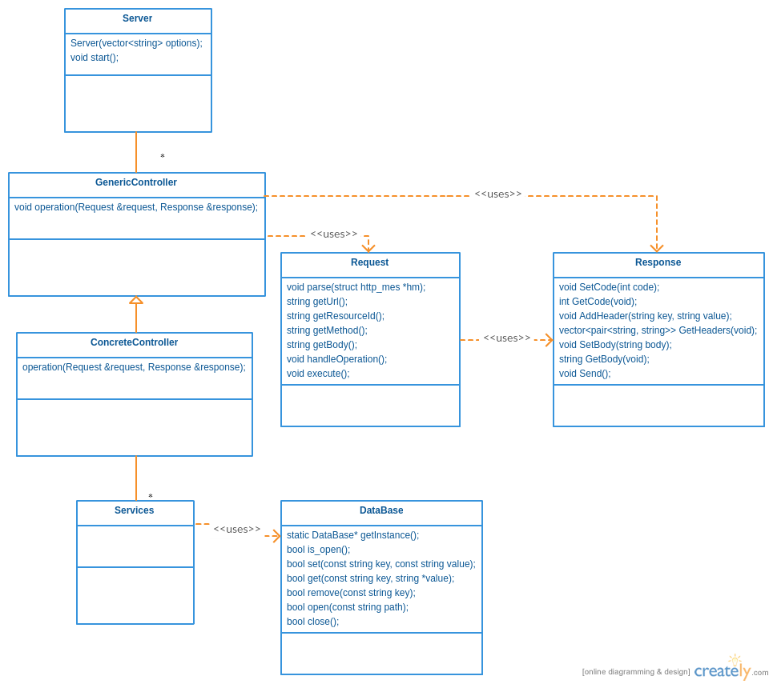
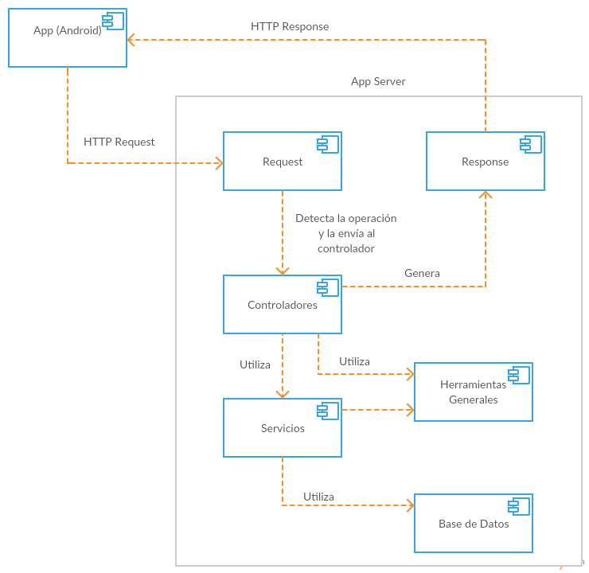
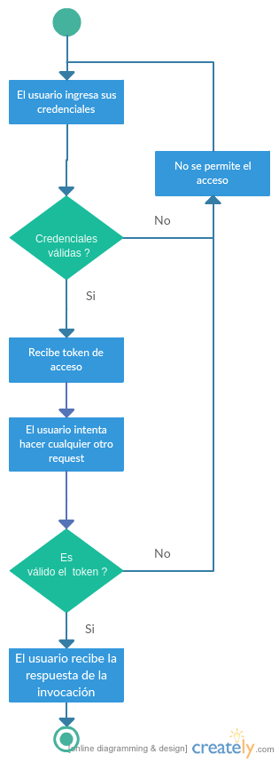
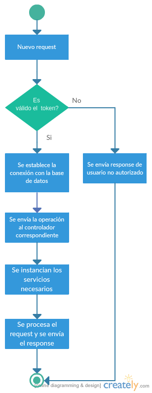
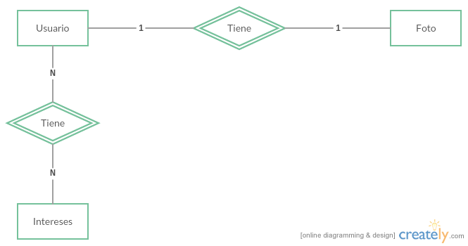
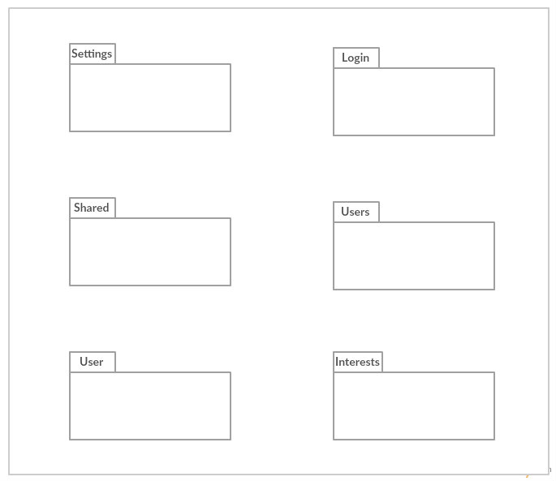
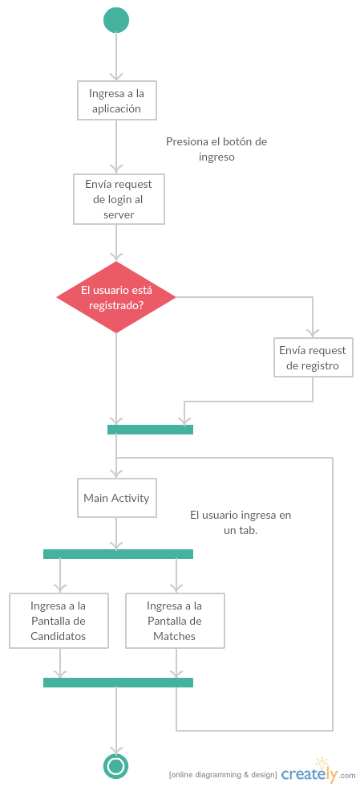

.. Documentación Tinder documentation master file, created by Grupo 6
   sphinx-quickstart on Sat May 28 15:26:38 2016.
   You can adapt this file completely to your liking, but it should at least
   contain the root `toctree` directive.

Bienvendio a la Documentación de Tinder
==============================================

Página de Búsquedas
==============================================

* :ref:`search`

################
App Server
################
Aquí se describirá la documentación del App Server. Este modulo de la aplicación es el intermediario entre la aplicación móvil y el shared server.
También es el encargado de almacenar la información relacionada a las preferencias de usuario, sus likes, matches y conversaciones.

================================
Documentación de Instalación
================================
El App Server es un servidor desarrollado en `C++ <http://www.cplusplus.com>`_ que contiene la lógica del negocio del proyecto. Está conectado a una base de datos no relacional para la cual se usa `RocksDB <http://rocksdb.org>`_ como administrador de base de datos.
Este servidor es un servidor intermedio entre el cliente Android y el Shared Server, y recibe y envía requests desde y hacia ellos utilizando `Mongoose <https://www.cesanta.com/products/mongoose>`_. 

-------------------
Desarrolladores
-------------------

^^^^^^^^^^^^^^^^
Clonar Branch
^^^^^^^^^^^^^^^^
Para descargar el branch y empezar a desarrollar sobre el mismo se debe ejecutar en la linea de comandos:

* ``git clone -b AppServerRefactor https://github.com/juandausa/tinder.git AppServerRefactor``

^^^^^^^^^^^^^^^^^^^^^^^^^^^^^^^^
Requerimientos Para su Uso
^^^^^^^^^^^^^^^^^^^^^^^^^^^^^^^^

* Posicionarse en la carpeta AppServerRefactor/AppServer y ejecutar ``sudo install.sh`` . Eso instalará las herramientas y recursos necesarios.

^^^^^^^^^^^^^^^^^^^^^^^^^^^^
Modos de Uso
^^^^^^^^^^^^^^^^^^^^^^^^^^^^

* Generar los ejecutables:
   * Posicionarse sobre la carpeta AppServerRefactor/AppServer y ejecutar ``cmake .``.
   * Luego ejecutar ``make``.
* Para correr los tests por consola:
   * Puede correr los tests mediante ``./ar/fi/uba/tallerii/test/runTests`` .
* Para correr el servidor utilizar lo anterior pero iniciar el server mediante ``./ar/fi/uba/tallerii/main/Tinder_main`` .
   * El servidor lo puede finalizar con ``Ctrl+C`` o eviandole cualquier señal distinta de ``-9``.
   
^^^^^^^^^^^^^^^^^^^^^^^^^^^^
Configuración en CLion
^^^^^^^^^^^^^^^^^^^^^^^^^^^^

* Importar el proyecto desde los fuentes desde la carpeta AppServerRefactor.
* Si le pregunta si desea crear nuevos archivos Cmake indique ``NO``.
* Los posibles targets son Tinder_Main y RunTests. El primero lanza el servidor y el segundo corre los tests.

^^^^^^^^^^^^^^^^^^^^^^^^^^^^
Políticas de Commit
^^^^^^^^^^^^^^^^^^^^^^^^^^^^

* Correr valgrind sobre los tests, utilizando los flags ``--leak-check=full`` .
* Correr cpplint para verificar los estilos de codificación. Desde la carpeta AppServer ejecute los siguientes comando y verifique que no hay errores:
   * ``./cpplint/cpplint.py --extensions=cpp --linelength=140 ./ar/fi/uba/tallerii/src/*``
   * ``./cpplint/cpplint.py --extensions=cpp --linelength=140 ./ar/fi/uba/tallerii/main/*``

-------------------
Usuarios
-------------------

^^^^^^^^^^^^^^^^^^^^^^^^^^^^^^^^^^^
Ejecutar Utilizando Docker
^^^^^^^^^^^^^^^^^^^^^^^^^^^^^^^^^^^

* Instale `Docker <https://www.docker.com>`_ des la web oficial.
* Descargue una copia del repositirio mediante ``git clone -b AppServerRefactor https://github.com/juandausa/tinder.git AppServerRefactor``.
* En la raiz ejecute el script ``sudo startDocker.sh`` .
   * Esto le abrirar una terminal con todas las dependencias necesarias para ejecutar el servidor.
   * Descargue el último release mediante ``wget https://github.com/juandausa/tinder/archive/vx.y.zAppServerRefactor.tar.gz`` y ejecute la aplicación mediante lo descrito en `Modos de Uso <#modos-de-uso>`_ .
   * En otro terminal ejecute  ``sudo docker inspect -f '{{.Name}} - {{.NetworkSettings.IPAddress }}' $(docker ps -aq)``. Esto le proveera un listado con todas las instancias de docker que posee corriendo y sus ip.

-------------------
API Web
-------------------

* Consultar `interfaz web App Server <https://docs.google.com/document/d/1lUKozaD6EfZabGmE2GwwCftcE25IU0Tyd3ERx7IhXPM/edit?usp=sharing>`_ .

================================
Documentación Técnica
================================
Cómo se dijo anteriormente el App Server está integramente desarrollado en `C++ <http://www.cplusplus.com>`_. A continuación de listan todas las librerias de terceros utilizadas:

============   ============   ========================
Herramientas   Versión        Url de Descarga
============   ============   ========================
Mongoose       6.4            https://github.com/cesanta/mongoose/archive/6.4.tar.gz
GLog           0.3.4          https://github.com/google/glog/archive/v0.3.4.tar.gz
GTest          1.7            https://github.com/google/googletest/archive/release-1.7.0.tar.gz
GFlags         2.1.2          https://github.com/schuhschuh/gflags/archive/v2.1.2.tar.gz
RocksDB        4.3.1          https://github.com/facebook/rocksdb/archive/rocksdb-4.3.1.tar.gz
LibCurl        7.48           https://curl.haxx.se/download/curl-7.48.0.tar.gz
LibJsonCpp     1.7.2          https://launchpad.net/ubuntu/+archive/primary/+files/libjsoncpp_1.7.2.orig.tar.gz
============   ============   ========================

-----------------------
Diagrama de Clases
-----------------------

^^^^^^^^^^^^^^^^^^^^^^^^^^^^^^^^^^^^^^^
Descripción de Responsabilidades
^^^^^^^^^^^^^^^^^^^^^^^^^^^^^^^^^^^^^^^
* Server: Este es el encargado de levantar el servidor y capturar los request. Además ofrece clases base para el manejo de response, estas fueron adaptadas para un manejo más simple y adecuado a las necesidades del proyecto.
* Request: Inspecciona los request y expone información como la url, el verbo y los parámetros. Esto es utilizado en el Server para decidir a donde derivar la solicitud.
* Response: Es la respuesta al cliente.
* Controladores: Encapsulan el comportamiento relacionado con una operación o conjunto cerrado de operaciones. Estos también se encargan de la comunicación con el Shared Sever.
* SecurityManager: Este servicio es transversal a todos los controladores. Está diseñado para detectar si el usuario se encuentra autenticado al momento de realizar un request.
* Servicios: Maneja el acceso a datos almacenados localmente. Encapsula cálculos sobre conjuntos de usuarios. 
* Base de Datos: Es la capa del acceso a los datos.

-----------------------
Diagrama de Flujo
-----------------------
* Diagrama de Componentes

* Diagrama de Flujo de Control de Sesión

* Diagrama de Flujo de Manejo de un Request

#################################
Shared Server
#################################
El Shared Server es un servidor desarrollado en `node.js <https://nodejs.org>`_ que ofrece las operaciones de alta, baja, modificación y consulta de usuarios. Consta de una base de datos relacional para la cual se usa `PostgreSQL <https://www.postgresql.org/>`_ como administrador de base de datos.

================================
Documentación de Instalación
================================
-------------------
Desarrolladores
-------------------
^^^^^^^^^^^^^^^^^^^^^^^^^^^^^^^^^^^
Probar el Shared Server
^^^^^^^^^^^^^^^^^^^^^^^^^^^^^^^^^^^
Actualmente se encuentra subido y corriendo en `Heroku <https://enigmatic-scrubland-75073.herokuapp.com/>`_ .
Se puede correr tambien de manera local como está indicado en el item "Ambiente local" de este archivo.
Se puede probar utilizando la API establecida en el enunciado del trabajo, o se puede tambien, probar utilizando el front end realizado (justamente para probar la API). A dicho front end se puede llegar con la ruta “/”.
Entonces, para acceder al frontend del shared server subido a Heroku basta con acceder a: https://enigmatic-scrubland-75073.herokuapp.com/ .

^^^^^^^^^^^^^^^^^^^^^^^^^^^^
Clonar Branch
^^^^^^^^^^^^^^^^^^^^^^^^^^^^

Para descargar el branch y empezar a desarrollar sobre el mismo se debe ejecutar en la linea de comandos:
 
* ``git clone -b SharedServer https://github.com/juandausa/tinder.git SharedServer`` .

^^^^^^^^^^^^^^^^^^^^^^^^^^^^
Probar Antes de Pushear
^^^^^^^^^^^^^^^^^^^^^^^^^^^^
* Correr el comando ``npm test`` para probar el código y pasarle pruebas de estilo y chequeo de sintaxis.
* Correr el comando ``npm start`` para correr el server y ver que ande normalmente. 

^^^^^^^^^^^^^^^^^^^^^^^^^^^^
Pushear a Repositorio
^^^^^^^^^^^^^^^^^^^^^^^^^^^^

* ``git push origin SharedServer``

^^^^^^^^^^^^^^^^^^^^^^^^^^^^
Pushear a Heroku
^^^^^^^^^^^^^^^^^^^^^^^^^^^^

* ``git push heroku SharedServer:master``

-------------------
Heroku
-------------------
^^^^^^^^^^^^^^^^^^^^^^^^^^^^
Ver Logs
^^^^^^^^^^^^^^^^^^^^^^^^^^^^
* Ejecutar en la consola ``heroku logs --tail`` .

^^^^^^^^^^^^^^^^^^^^^^^^^^^^^^^^^^^
Entrar a Postgres en Heroku
^^^^^^^^^^^^^^^^^^^^^^^^^^^^^^^^^^^
* Ejecutar en la consola ``heroku pg:psql`` .

-------------------
Ambiente Local
-------------------
En esta sección se indica todo lo necesario para probar el server localmente.

^^^^^^^^^^^^^^^^^^^^^^^^^^^^^^^^^^^
Requerimientos para Uso Local
^^^^^^^^^^^^^^^^^^^^^^^^^^^^^^^^^^^

* Instalar node.js así como su manejador de paquetes, `npm <https://www.npmjs.com/>`_ mediante el siguiente comando: ``sudo apt-get update; sudo apt-get install nodejs; sudo apt-get install npm;``
* Instalar postgreSQL ``sudo apt-get install postgresql-9.4``.
* Abrir postgres, ejecutando el comando: ``psql -U postgres`` .
* Crear la base de datos **users**, ejecutando dentro del interprete de postgres ``CREATE DATABASE users`` .
* Crear las tablas necesarias ejecutando el script ``create_table.sql`` .

^^^^^^^^^^^^^^^^^^^^^^^^^^^^
Correr Server Local
^^^^^^^^^^^^^^^^^^^^^^^^^^^^

* Para correr el server localmente se debe ejecutar el comando: ``heroku local``

-------------------
API Web
-------------------
* Consultar `interfaz web Shared Server <https://docs.google.com/document/d/1xRC2wTo4CRqe-7736FFCgLUOsSzKJn2EOubYEawvf50/edit?usp=sharing>`_ .

================================
Documentación Técnica
================================

--------------------------------------
Tecnologías Utilizadas
--------------------------------------

* Para la base de datos se utilizó: `PostgreSQL <https://www.postgresql.org/>`_.
* Para el servidor se utilizó: `NodeJS <https://nodejs.org>`_.
* Para la App web se utilizó: `Angular <https://angularjs.org/>`_ & `Angular Material <https://material.angularjs.org/>`_.

--------------------------------------
Clases Principales
--------------------------------------

La clase pricipal es `User` que modela al usuario.

--------------------------------------
Estructura de Tablas
--------------------------------------

-----------------------------------
Diagrama de Paquetes
-----------------------------------

#################################
App Móvil
#################################

El cliente es una aplicación desarrollada en android que ofrece al usuario la posibilidad de:

* Loguearse mediante facebook (utilizando sus APIs).
* Dar Like o no a gente cercana que cumple con las caracteristicas establecidas por el usuario.
* Mostrar matches con personas.
* Establecer una comunicación con los matches.
* Configurar los filtros mediante los cuales se regula que personas se le son mostradas al usuario.
* Ver y editar el perfil del usuario.

================================
Documentación de Instalación
================================

--------------------------------------
Ejecutar y Probar la Aplicación
--------------------------------------

^^^^^^^^^^^^^^^^^^^^^^^^^^^^
Condiciones
^^^^^^^^^^^^^^^^^^^^^^^^^^^^

La aplicación android se ha probado bajo las siguientes condiciones:

* Corriendo en un smartphone con Android con una versión igual o superior a la 4.0. (Cerca del 90% de los teléfonos en el mercado cumplen con esto según la documentación de Android).
* El teléfono sobre el que se corre la aplicación tiene una conexión a internet disponible.
* El teléfono está conectado a la misma red wifi que la computadora donde se está corriendo el servidor al que le envía requests.
* El servidor al que le envía requests es un MockServer que corre en localhost y tiene respuestas predefinidas para probar la aplicación. 
* Para poder correr este servidor se necesita instalar las dependencias, por lo que dentro de la carpeta /MockServer se debe ejecutar el comando sudo npm install.
* El servidor debe estar corriendo en la dirección ip de la red 192.168.1.106 o en su defecto, se deberá cambiar dicha dirección ip en el archivo Constants.java en el atributo publico `IP_SERVER`. (Esto se debe hacer así por el momento debido a la falta de conocimiento de cómo tener un archivo de configuración para la aplicación).

Para instalar y correr la aplicación en un teléfono, se debe copiar el apk disponible en el repositorio a alguna carpeta del teléfono e instalarlo.

^^^^^^^^^^^^^^^^^^^^^^^^^^^^
Clonar Branch
^^^^^^^^^^^^^^^^^^^^^^^^^^^^

Para descargar el branch y empezar a desarrollar sobre el mismo se debe ejecutar en la linea de comandos:

* ``git clone -b App https://github.com/juandausa/tinder.git App``

^^^^^^^^^^^^^^^^^^^^^^^^^^^^^^^^^^^^^
Requerimientos para su Uso
^^^^^^^^^^^^^^^^^^^^^^^^^^^^^^^^^^^^^

* Instalar el IDE `Android Studio <https://developer.android.com/sdk/>`_ .
* Instalar todas las librerias de la 23 en adelante desde el SDK Manager (dentro del Android Studio).

^^^^^^^^^^^^^^^^^^^^^^^^^^^^^^^^^^^^^^^^^^^^^^^^^^^^^^^^^^^^^^^^^^^^^^^^^^^^^^^^^^^^
Chequeo de Estilos, Bugs, Linter, etc.
^^^^^^^^^^^^^^^^^^^^^^^^^^^^^^^^^^^^^^^^^^^^^^^^^^^^^^^^^^^^^^^^^^^^^^^^^^^^^^^^^^^^

Para chequear que todo este correcto antes de subir código al repositorio realizar los siguientes pasos:

* Situarse con la consola en ``App/app/``
* Ejecutar el comando ``./gradlew build``
* Verificar si realizó el build correctamente. De haber fallado, observar que fué lo que falló leyendo el archivo de reportes indicado por la salida del comando que acabamos de ejecutar.
* Corregir el problema, repetir los pasos anteriores y subir al repositorio.

^^^^^^^^^^^^^^^^^^^^^^^^^^^^^^^^^^^^^
Integración con Facebook
^^^^^^^^^^^^^^^^^^^^^^^^^^^^^^^^^^^^^

El login al cliente Android se realiza mediante facebook, por lo que es necesario realizar los siguientes pasos para lograr un login exitoso.

- Generar un `key hash` para el ambiente de desarrollo de cada desarrollador. Para esto:
    - Abrir la consola.
    - Ejecutar el comando: ``keytool -exportcert -alias androiddebugkey -keystore ~/.android/debug.keystore | openssl sha1 -binary | openssl base64``
    - Darle `enter` cuando pida una contraseña.
- Dirigirse a la `sección de Ajustes del sitio web de la app en developers facebook <https://developers.facebook.com/apps/469716263220924/settings/>`_.
- Copiar el código generado por el comando en el campo Key Hashes (sin borrar los que ya se encuentran).
- Guardar cambios.

================================
Documentación Técnica
================================

--------------------------------------
Tecnologías Utilizadas
--------------------------------------
* La aplicación se desarrollo en Java utilizando el SDK de `Android <https://www.android.com/>`_.

--------------------------------------
Clases Principales
--------------------------------------

* La clase principal es `User` que modela el usuario.

--------------------------------------------------------
Diagramas de Clases, Paquetes, Flujo, etc
--------------------------------------------------------

^^^^^^^^^^^^^^^^^^^^^^^^^^^^^^^^^^^^^
Flujo de la App
^^^^^^^^^^^^^^^^^^^^^^^^^^^^^^^^^^^^^

Descripción:

* La primer activity, es `LoginActivity`, que tiene un botón de Facebook. 
* Cuando se presiona, se invocan una serie de asyncTasks que obtienen los datos de perfil de Facenook. Luego se procesan esos datos y se entregan al `LoginRequest`. 
* Este envía intenta loguearse contra el servidor. Si el usuario está registrado, el request devuelve un OK y pasa por un a `MainActivity`. 
  * Si no esta registrado, se envian los datos de usuario por medio del `NewRegisterRequest`, y una vez que se obtiene la respuesta pasa a `MainActivity`.
* A su vez, existe también un `SessionManager`, que guarda si el usuario está logueado o no. Asi, si el usuario abandonó la app y estaba logueado, cuando vuelva seguirá logueado.
* `MainActivity` posee 2 pantallas, que son fragments, que corresponden a dos tabs.
* En la primera se situan las cards de los candidatos.
* En la segunda se muestran los matches.

################
General
################

================================
Modo de Trabajo
================================

--------------------------------------
Herramientas
--------------------------------------
Desde la primera iteración comenzamos con la integración de todas las herramientas propuestas por la cátedra. Esto fue realmente útil en los checkpoints, ya que en esos momentos no tuvimos que preocuparnos por estas tareas y quitarle tiempo al desarrallo.

--------------------------------------
División de Tareas
--------------------------------------
Si bien la división de tareas no estableció una asignación específica para cada parte del proyecto a determinado desarrollador, muchas de las tareas de la misma tecnología fueron tomadas por las mismas personas.
En el caso de App Server, hubo participación de los cuatro miembros, dado que esta fue la sección que involucró mayor incertidumbre.

================================
Mejoras Propuestas y Faltantes
================================
*

================================
Errores Conocidos
================================
*
